# Group 5: Staff Payroll and Allowance Processing Simulator

## Group Members

| Name | Registration Number |
|---|---|
| Janice Muthoni |C026-01-0907/2025 |
| Joy Wandati |C026-01-0906/2025 |
| Timothy Mbugua |C026-01-0901/2025 |


## Programming Languages Lab Assignment | Names, Bindings and Scopes**
### *Language Used `C++`*
---

This Readme File shows every core concept required in this assignment, the exact function or variable in our program where it is demonstrated, and explains the observed behaviour. 

---

## 2. Concept-to-Code Mapping

| Concept | Where it appears in the code | Explanation |
|---|---|---|
| **Static type binding** | `StaffRecord` struct fields (`staffId`, `name`, `basicPay`, `houseAllowance`, `transportAllowance`, `isActive`); all function parameters and return types | Each field or parameter is bound to one fixed type (`std::string`, `double`, `bool`) at compile time. The compiler checks every use of that name against this type before the program runs, and the binding never changes for the variable's lifetime. |
| **Type inference (`auto`)** | `auto net = computeNetPay(gross, training);` and `auto totalDeduction = training + OTHER_DEDUCTIONS;` (inside the staff loop in `main()`) | The compiler examines each initializer expression and deduces a concrete type at compile time; Both are inferred as `double`, since `computeNetPay()` returns `double` and `training`/`OTHER_DEDUCTIONS` are both `double`. The binding is still static; `auto` only removes the need to type the name explicitly. |
| **Parameter scope and lifetime** | `computeGrossPay(const StaffRecord& r)` and `computeTrainingDeduction(double gross)` | The parameters (`r`, `gross`) and locals (e.g. `gross` inside `computeGrossPay`, `deduction`/`excess` inside `computeTrainingDeduction`) exist only for the duration of that function call (stack-dynamic lifetime), and are visible (in scope) only within that function's body. |
| **Static local variable** | `static int payslipCount` inside `printPayslip()` | Declared with `static`, so it is initialized only once, on the first call, and then persists in static storage for the entire program run ; surviving between calls, unlike an ordinary local, which is destroyed on return. Its *name* is still scoped only to `printPayslip()`. |
| **Shadowing** | `double basicpay` declared in the staff loop in `main()`, then re-declared inside the nested `{ }` block immediately below it | The inner `basicpay` temporarily hides (shadows) the outer `basicpay` for as long as the nested block is active. Once the block's closing brace is reached, the inner variable is destroyed and the name `basicpay` again resolves to the outer one. |
| **Reference / output parameters and aliasing** | `computeGrossAndDeduction(const StaffRecord& r, double& outGross, double& outDeduction)` | `outGross` and `outDeduction` are reference parameters. When `main()` calls `computeGrossAndDeduction(r, gross, training)`, `outGross` becomes an alias for `main()`'s `gross`, and `outDeduction` becomes an alias for `main()`'s `training` ; two names for the same memory location for the duration of the call, so writes inside the function are immediately visible in `main()`. |
| **Named constants** | `TRAINING_BAND_LIMIT`, `TRAINING_RATE_LOW`, `TRAINING_RATE_HIGH`, `OTHER_DEDUCTIONS`, `MIN_STAFF_RECORDS` (declared at file scope, top of file) | Fixed policy values are given descriptive names instead of being repeated as unexplained literals (e.g. `0.10`, `50000.0`) throughout the code, making the rules easier to read, verify, and change in one place. |
| **Input validation / exceptional cases** | `getValidatedString()`, `getValidatedDouble()`, `getValidatedYesNo()` in the input-functions section | Three distinct invalid-input cases are handled: an empty string (`getValidatedString`), non-numeric text typed where a number is expected (`std::cin.fail()` check in `getValidatedDouble`), and a negative pay/allowance value (`value < minValue` check in `getValidatedDouble`). |
| **Why static type binding catches errors early** | Comment block at the end of `main()`, after `return 0;` | Because every variable's type is fixed at compile time, the compiler can reject type-mismatched code (e.g. assigning a `std::string` to a `double` field) before the program is ever run, converting a possible runtime bug into a compile-time error that must be fixed first. |

---

## 3. Scope and Lifetime Table for Key Variables

| Variable | Kind | Scope (where the name is visible) | Lifetime (when it exists in memory) |
|---|---|---|---|
| `gross` (in `computeGrossPay`) | Local variable | Function body of `computeGrossPay` only | Stack-dynamic: created on call entry, destroyed on return |
| `deduction`, `excess` (in `computeTrainingDeduction`) | Local variables | `deduction`: whole function body. `excess`: only inside the `else { }` block | Stack-dynamic; `excess` is destroyed as soon as the `else` block ends, before the function even returns |
| `outGross`, `outDeduction` (in `computeGrossAndDeduction`) | Reference (output) parameters | Function body of `computeGrossAndDeduction` only | Exist only for the duration of one call; alias whichever variables the caller passed in |
| `payslipCount` (in `printPayslip`) | Static local variable | Function body of `printPayslip` only (name not visible elsewhere) | Static: created once on the first call, persists for the entire program run |
| `basicpay` (outer, in the `main()` staff loop) | Local variable | One iteration of the staff `for` loop in `main()` | Stack-dynamic: created at the top of each loop iteration, destroyed at the end of that iteration |
| `basicpay` (inner, nested block in `main()`) | Local variable (shadows the outer `basicpay`) | The nested `{ }` block only | Stack-dynamic: created when the block is entered, destroyed when the block's closing brace is reached |
| `staff` (in `main()`) | Local variable (`vector<StaffRecord>`) | Entire body of `main()` | Stack-dynamic, but the underlying dynamic array is heap-allocated internally by `std::vector` and grows as records are added; both are destroyed together when `main()` returns |
| `sumGross`, `sumDeductions`, `sumNet`, `highestNet`, `totalPayslipsPrinted` (in `main()`) | Local variables (accumulators) | Entire body of `main()` | Stack-dynamic: created once before the loop, updated across all iterations, destroyed when `main()` returns |

---

## 4. Referencing Environment Summary

C++ uses **static (lexical) scoping** throughout this program: every name is resolved by *where it is written* in the source text, not by which function happened to call which. This is why the parameter named `gross` inside `computeTrainingDeduction()` is completely unrelated to the local variable also named `gross` inside `computeGrossPay()` ; despite the identical spelling, and despite one function's result feeding into the other at the call site in `computeGrossAndDeduction()`. The compiler resolves each occurrence of `gross` using only its own function's enclosing scope.

Similarly, the nested-block `basicpay` in `main()` resolves to the innermost enclosing scope while inside the block, and reverts to the outer `basicpay` the instant the block's closing brace is reached ; proof that C++ name resolution follows the physical nesting of braces in the source code, not the runtime order of execution.

---

## 5. Test Runs Log

**Successful run 1:** 5 active staff records, all valid input on first attempt.
**Successful run 2:** gross pay exactly at the training band boundary (50,000) — confirms the `<=` branch applies the low rate only.
 **Successful run 3:** gross pay above the boundary (e.g. 75,000) — confirms the two-tier calculation in the `else` branch.
 **Boundary/error run 1:** non-numeric text entered for Basic Pay (e.g. `"James Blue"`) ; confirms `getValidatedDouble()` rejects and re-prompts.
**Boundary/error run 2:** empty Staff ID or name submitted (Enter pressed with no text) ; confirms `getValidatedString()` rejects and re-prompts.

---

## 6. Screenshots — Test Run Evidence

### Successful run 1 - 5 active staff records, all valid input
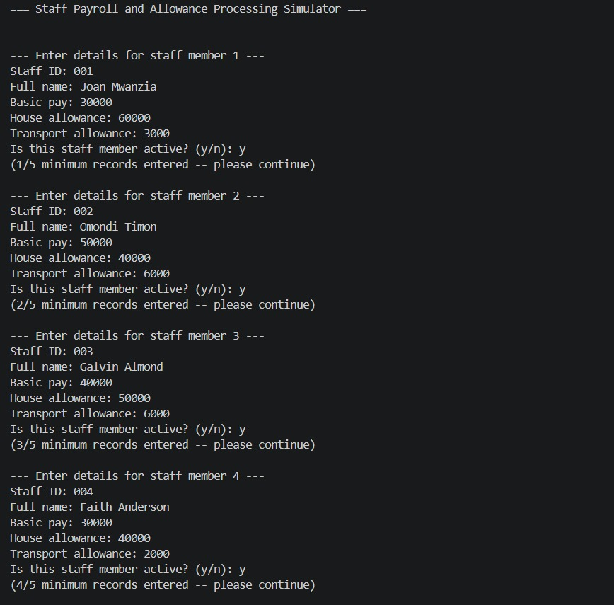
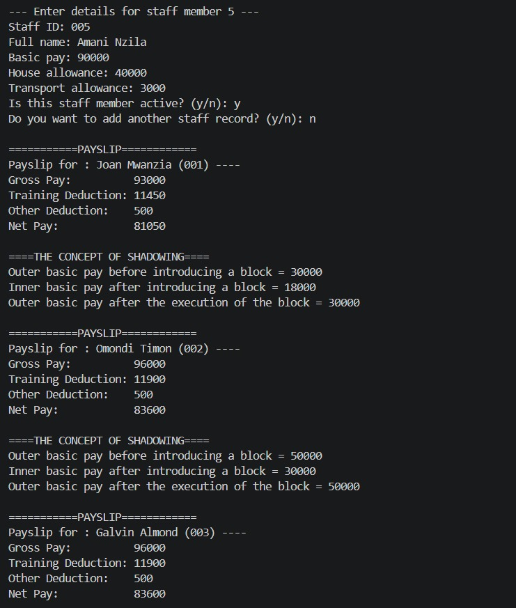
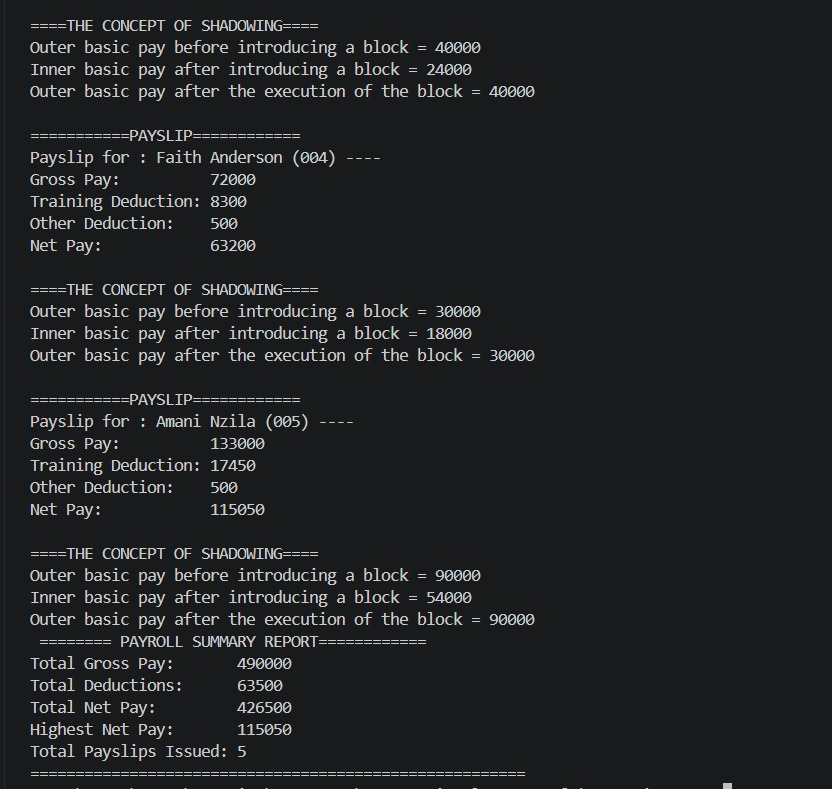

### Successful run 2 - gross pay exactly at the training band boundary (50,000)
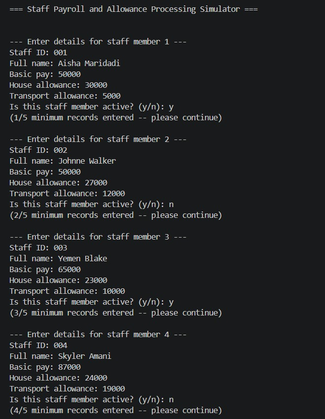
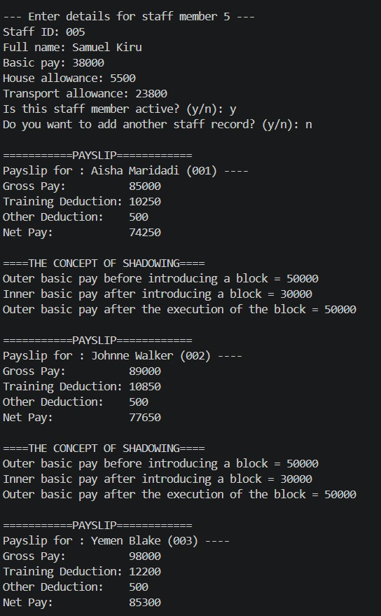
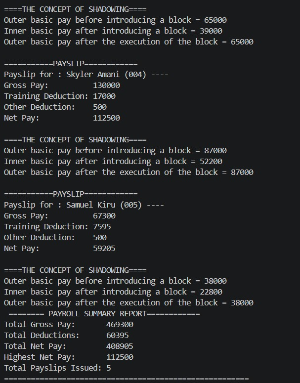

### Successful run 3 - gross pay above the boundary (e.g. 75,000)
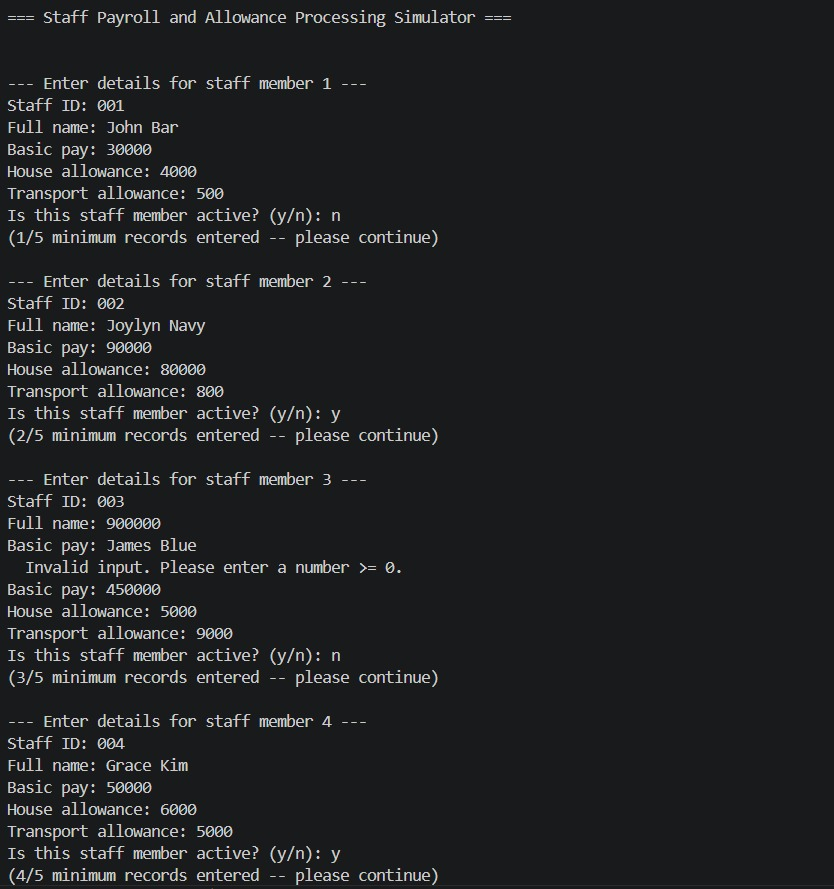
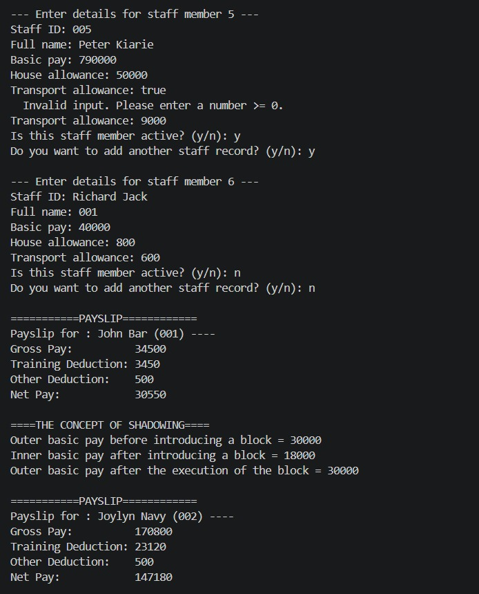
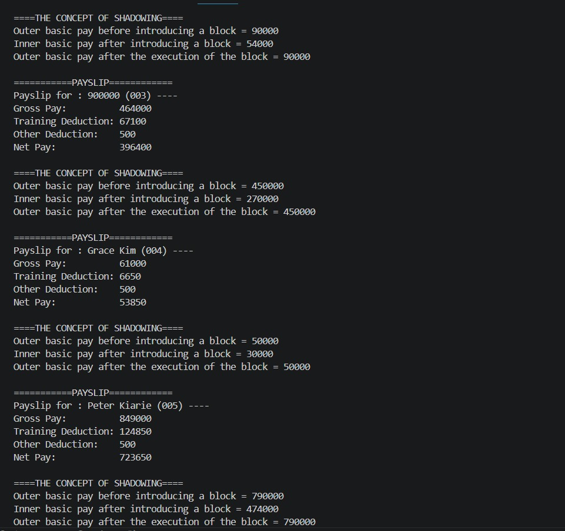
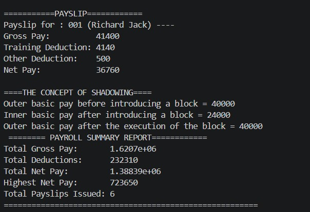

### Boundary/error run 1 - non-numeric text entered for Basic Pay
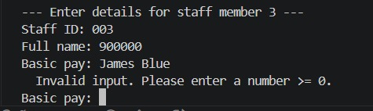

### Boundary/error run 2 - empty Staff ID or name submitted
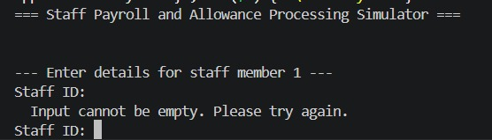


---

## 7. Command to Build and Run

```bash
g++ -std=c++17 -Wall -o staffPayroll staffPayroll.cpp
./staffPayroll
```